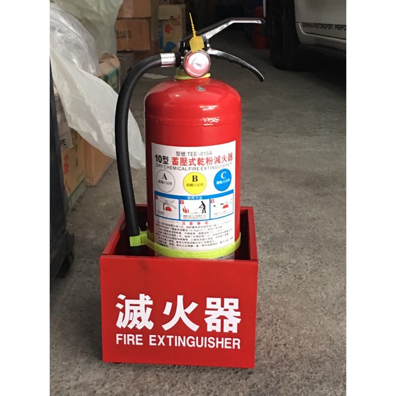

## 一氧化碳
一氧化碳中毒多因通風不良、蓄積一氧化碳濃度過高
* 安裝場所通風不良
* 選用錯誤燃氣設施(例：室室外型安裝於室內)
* 缺乏安全意識
* 熱水器不良安裝
* 熱水器未能適當運作
* 沒有定期檢查與維護

### 液化石油氣
* 丙烷+丁烷
* 無色、無味、無毒
* 易燃、易爆，具有窒息性
* 比重 (1.55~2.1) 比空氣 (1.0) 重
* (我覺得會考)
> 爆炸範圍：空氣混入 (1.8%~9.5%) 的液化石油氣，在此範圍外均無法爆炸

### 天然氣
* 約 90% 的甲烷
* 無色、無味、無毒
* 易燃、易爆，具有窒息性
* 比重 (0.56~0.79) 比空氣 (1.0) 輕
> 爆炸範圍：空氣混入 (4.5%~15%) 的天然氣，在此範圍外均無法爆炸

### 瓦斯
* 單純窒息性氣體 及 中樞神經抑制劑
* 空氣中天然氣最大許可度為 1%，如果空氣中天然氣濃度達 20%會使人窒息失神，因為它會趕走氧氣，導致 缺氧窒息死亡
* 一般俗稱的瓦斯中毒，應該稱作為一氧化碳中毒死亡 
* 瓦斯為無色、無味，所以添加臭味劑，所以有臭味

### 分辨瓦斯正確燃燒
* 氧氣供應正常：火焰外焰呈紫藍色，內焰呈淡青色
* 當火焰頂端呈現為紅色，代表氧氣供應不足，形成不完全燃燒，產生一氧化碳
* 如果火焰呈現跳動，則為氧氣過多，容易被吹熄
* 一氧化碳與紅血球的結合力是氧氣與紅血球的 200~250 倍

### 一氧化碳中毒處理方法
* 如果發現有人一氧化碳中毒，立刻 ```緩緩打開門窗```
* 搬移至空氣流通的處所，讓他平躺，有假牙要取出，鬆開中毒者衣物，並蓋上毯子保暖
* 盡快實施人工呼吸、心肺復甦術或用氧氣急救
* 緊急送醫

### 防範一氧化碳中毒
* 選用安全標章(TGAS)
* 調節瓦斯進氣閥、空氣調節閥
* 瓦斯熱水器安裝於通風處：勿安裝於室內、浴室...等密閉處
* 瓦斯熱水器如果裝於陽台，應選購有強制排氣功能的產品，加裝排氣導管
* 瓦斯熱水器裝設於陽台，如果有裝鋁門窗或是氣密窗，應將窗戶全數打開，使空氣對流 ```不可只開一扇窗```

### 如何防範瓦斯氣爆
* 發現鄰居激烈爭吵，應即報警處理
* 正確使用及經常檢查瓦斯
* 瓦斯鋼瓶應直立固定，不可橫置、搖晃及受熱源照射
* 使用肥皂水檢查橡皮管，絕不可用點火測漏，瓦斯大量漏氣會有聲音
* 如果鋼瓶有結霜，代表已有瓦斯外漏
* 橡皮管不宜過度彎曲，長度不超過一公尺，使用一至兩年應給予更換
* 應避免火焰被溢出的湯水濺到，造成瓦斯漏氣

### 瓦斯安全輔助器材
* 微電腦瓦斯表
* 瓦斯漏氣警報器
* 一氧化碳偵測警報器
* 電池式煙霧偵測警報器
* 滅火器

### 瓦斯火災
* 關閉瓦斯表前面開關及所有瓦斯器具開關
* 使用滅火器、水、砂土、濕毛巾
* 如果鍋子著火，可用鍋蓋或是浸濕的毛巾直接覆蓋滅火
* 使用冰水、冰塊冷卻鄰近設備
* 撥打電話 119，並通知瓦斯公司

### 常見起火成因
* 電氣因素：主要為缺乏保養
    * 短路：兩個電路不同極的碰在一起
    * 過負載：通常是老舊房屋，舊電路，現代電子產品，或是插太多延長線，高電功率的設備
    * 積污導電：容易短路，累積汙垢導致兩端接在一起，離地板面接近的地方
    * 斷線或半斷線：造成溫度上升，預防方式為拔頭，不要拔線
    * 電器本身：例如除濕機、吹風機
* 煮食不慎
* 縱火行為：精神異常、厭世
* 吸菸引起
* 引火性易燃物：像是酒精

### 火災分類
* A類：普通火災
* B類：油類火災
* C類：電氣火災
* D類：金屬火災```可燃性金屬為禁水性金屬，需用特殊藥劑滅火```

### 滅火原理
* 可燃性：拆除法
> 搬離或去除可燃物
* 助燃物：窒息法
> 遮斷助燃物
* 熱能：冷卻法
> 減少熱能
* 連鎖反應：抑制法
> 破壞連鎖反應

<br>

### 上課小題目
鐵皮屋、木構造房子、混泥土構造的房子，哪一個會燒的最猛烈：<br>
鐵皮屋 » 木造房 » 混凝土的房子<br>
<br>
一杯高粱酒起火，桌上有水、綠茶、可樂、啤酒、小毛巾<br>
要用什麼滅火，什麼不能滅火：<br>
答案是通通都可以

<br>

## 好像說要考？
* 火災的特性
    > 成長性 <br>
    不定性  <br>
    偶發性
* 熱的傳導
    > 傳導<br>
    對流<br>
    輻射
* 火災的產物
    > 火焰<br>
    熱度<br>
    煙
* 火災的應變
    > 報案<br>
    滅火<br>
    避難逃生

# 求生原則
### 看見火：逃生
### 看見煙：避難

### 避難時關門的重要性
* 濃煙是火場最大的殺手
* 不是火！

### 上課的腦力激盪

1. 一般 10 型滅火器從拉開安全插銷開始到噴完，可以噴多久？ <br/>



> 10 分鐘<br>
2 分鐘<br>
8 ~ 15 秒

* ANS：8 ~ 15 秒

<br/>

2. 在火災時，決定是否逃離房間下列何者不是必要的判斷方式
<br/>

> 觸摸門板的溫度<br>
運用視覺及嗅覺，看看有沒有煙或有沒有聞到煙味<br>
觸摸門把溫度是否上升<br>
跑到窗口看看火煙狀況<br>

* ANS：跑到窗口看看火煙狀況

<br>

3. 下列何者不是廚房起火之主因？

> 忘記關爐火<br>
油鍋起火<br>
瓦斯外洩<br>
小孩玩火

* ANS：小孩玩火

<br>

4. 滅火器最好放置於何處？

> 廚房<br>
儲藏室<br>
客廳門口<br>
陽台

* ANS：客廳門口

<br>

5. 用手機撥打火警報案電話除了 119 外尚可撥打哪一個號碼？

> 112<br>
117<br>
118

* ANS：112

<br>

6. 火場中的頭號殺手？

> 熱度<br>
火焰<br>
濃煙

* ANS：濃煙

<br>

7. 瓦斯的特性下列何者為非？

> 有毒<br>
沒有毒<br>
具有可燃性

* ANS：有毒

<br>

8. 半夜發現火警，第一件事要做什麼

> 滅火<br>
報案<br>
叫醒家人

* ANS：叫醒家人

<br>

9. 下列有關安全門之敘述何者錯誤？

> 安全門是阻隔火煙用<br>
安全門不可上鎖<br>
安全門平常要打開方便逃生<br>
安全通常會自動關閉

* ANS：安全門平常要打開方便逃生

<br>

10. 家庭最重要的消防設施是什麼

> 火警探測器<br>
滅火器<br>
緩降機

* ANS：火警探測器

<br>

### 煙對避難人員的影響
* 高溫性
* 窒息性
* 有毒性
* 遮蔽性

### 液化石油氣儲備量
* 一般家庭 40 公斤(2支)
* 營業場所 80 公斤(4支)